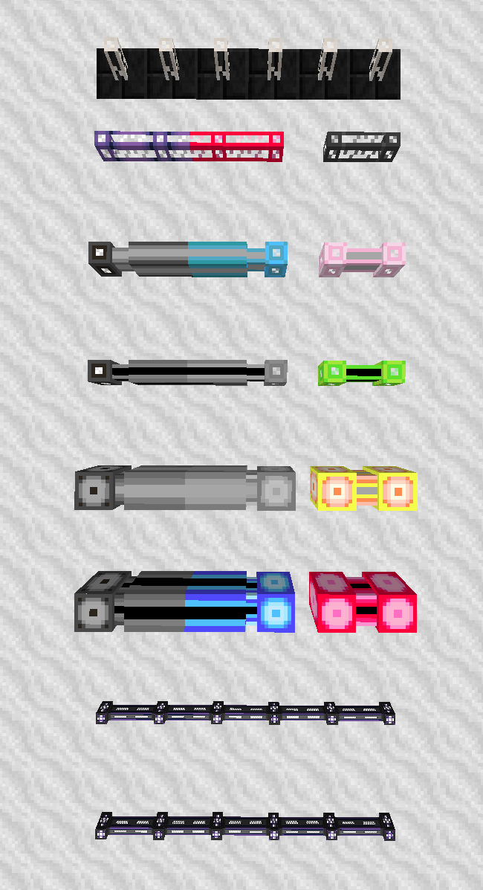

Author: Shadoyama#4166

# The Basics

In this section, I'll be going over the basics of cabling and channels, just to make sure everyone understands or is on the same page as I am. If you understand the different types of cables, channels, and other basic stuff, this can be skipped.

## Types of Cable

This section will talk about the different types of cable and the advantages and disadvantages of using each type.

Firstly, there are 4 different cables from Applied Energistics, and 2 from Ender IO. Here are the following from AE2:
- Quartz Fiber
- ME Glass Cable
- ME Smart Cable
- ME Dense Smart Cable

EnderIO has both the ME Smart Cable and ME Dense Smart Cable, but they are both conduits, allowing for energy conduits and any other conduit from EnderIO to run alongside it in the same block. However, as I'll note in the next section, they have differences.

Here are what each cable/conduit is typically used for, and just general knowledge about the cables/conduits:

- Quartz Fibers is the only one out of the six that do not transfer channels, but rather just power. This makes them good for both powering P2P networks and subnetworks, both of which will be explained later on. They also aren't an individual cable however, as they are an attachment to a cable (examples in picture below). They also don't take up a block when connected to other cables.
- ME Glass Cables is a cable that transmits both power and channels, with the maximum amount of channels allowed being 8 channels. These are very similar to the next cable, and can be interchanged *almost* freely.
- ME Smart Cables is very similar to Glass cables, however they display the amount of channels shown on the cable, with each line representing one channel. These, alongside the previous cable, are the only ones you can use to connect any AE2 non-full block to the system (Export bus, storage bus, etc...)
- ME Dense Smart Cable is the same as the previous, however they can hold up to 32 channels on a single line. These cables however can only connect to devices that take up a full block (The full-block variant of ME interfaces, Molecular Assemblers, etc...)
- Both of the EnderIO conduits serve the same purpose as the ME Smart Cables and ME Dense Cables, however the main differences are that you can not visually see the channels on the cable, and the normal ME Conduit can only connect to devices that take up a full block.

Here is a picture to visually show the different cables/conduits, in order that was described.

Do note that Glass Cables, Smart Cables, and Dense Smart Cables all have different colored variants. Besides aesethics, different colored cables can not connect to each other, however 'Fluix' Cables can connect to any colored cable, which is how you can connect all the different colored cables together.

## Channels

The first thing, and a very large thing that needs to be understand is how channels work, when they are used, and how to get more, which I will cover in this section.

Channels can only be 'created' by a ME Controller. Each side of the controller can support up to 32 channels, with there being no way to increase the amount of channels per side. You can add multiple controllers to a single network, however they need to all be directly connected to one another, and can not exceed the size of a 7x7x7 block. 

Channels are fairly simple. Any device that serves any purpose within a network, whether it be exporting items, importing items, acting as an interface to the network, whatever it may be, will use a channel. This means if you were to use a Glass Cable to power inscribers, the inscribers will not use channels, as they do not interact with the system besides with power. However, connecting to a 'blank' interface (an interface with nothing in it) will still count as a channel.

# Cable Management

Alright, now to the fun stuff: P2Ps and cable management. I'll go over P2Ps first, as they are required for cable management.

## P2P

P2P channels have 6 different types: FE, Light, Redstone, Fluid, Item, and ME. For this guide, we will only use the ME P2P, as those are the only ones that will interact with the ME system itself. To bind a P2P to another, you will first need a memory card and then you need to shift right-click on the input cable, and then right-click on the output P2P.

**DO NOT USE THE ADVANCED MEMORY CARD, THIS IS KNOWN TO CAUSE CRASHES**

P2Ps by themself do not do anything. A P2P network is separate from the main network, in the regard that they don't directly interact with one another. Storages on the main network *technically* are not visible on the P2P network, but you should ideally not need to use the P2P network for storage or autocrafting.

The base purpose of a P2P channel is meant to be a logical management. This guide isn't going to be using that much, but here is a website with a description of how the P2P was designed, and what purpose it is intended to have: https://appliedenergistics.github.io/features/me-network/channels

## Actual Cable Management

Now, the way I described that P2P is not the way we will be using P2P. The way we will be using P2P is to condense channels to reduce the amount of wiring necessary to run around the base, specifically anywhere from the normal 32 channels on a line, upwards to 1024 channels on a single line. The way this works is a little complicated, so here is an image, in which I'll explain what is going on.

In the above screenshot, each dense cable has their own P2P channel ID, in which none of them share the same connection. However, now that they are all being transported over the P2P network, each dense cable is equivalent to 1 channel on the smart cables. You can run those smart cables either into a dense cable, or use another controller since the P2P network is separate from the main network.

This can best be shown in the following screenshot, in which a total of 1024 channels will be accessible, and 64 channels being actively used using P2P.

Keep in mind, this is only using 2 sides of the controller, when on the P2P network there was 32 sides of the controller available. You can also still add an additional 16 from the other two sides that were not connected, and also the sides that are in the inside of the controller.

However, as noted earlier, it is **upwards** of 1024 channels, not always. Depending on how many times you access a single dense cable connected to the controller will affect the maximum condensing per channel. If you use 1 input and 1 output, you successfully get a 32:1 channel ratio. If you use 2 outputs for every input, you would have a 16:1, resulting in 512 channels on single dense cable. This ultimately should save you a lot of cabling needed to be done in order to connect the base.
