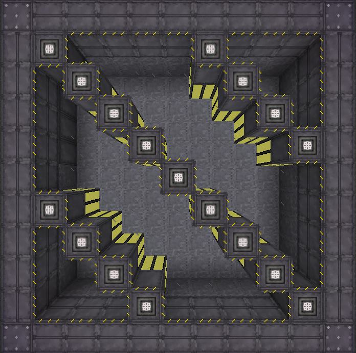
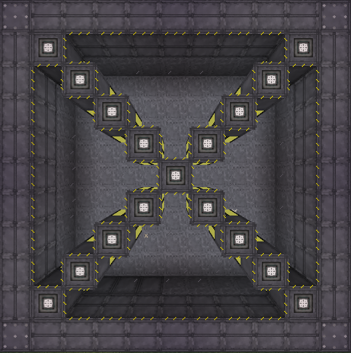

Author: WaitingIdly

# How to Increase Cyanite Production

Extreme Reactors consume Yellorium to produce energy, with Cyanite being created as a byproduct. To increase energy production, you want to increase the efficiency - but to increase Cyanite production, you actually want to *decrease* the efficiency.

Efficiency is increased by having some coolant in the reactor and by having Reactor Rods placed near each other. Thus, to construct a reactor producing more Cyanite, you want two things:
1. no coolant, only air
2. having all Reactor Rods positioned at least 4 blocks away from each other

For example, this pattern of Reactor Rods produces over 3 times as much Cyanite per second as...

The exact same number of rods in a different layout, causing some rods are within 4 blocks of another rod.

This example reactor is 11x11x3, with an interior of 9x9x1, and a total of 17 Reactor Control Rods. The maximum size of an Extreme Reactor is 32x32x48, with an interior of 30x30x46.