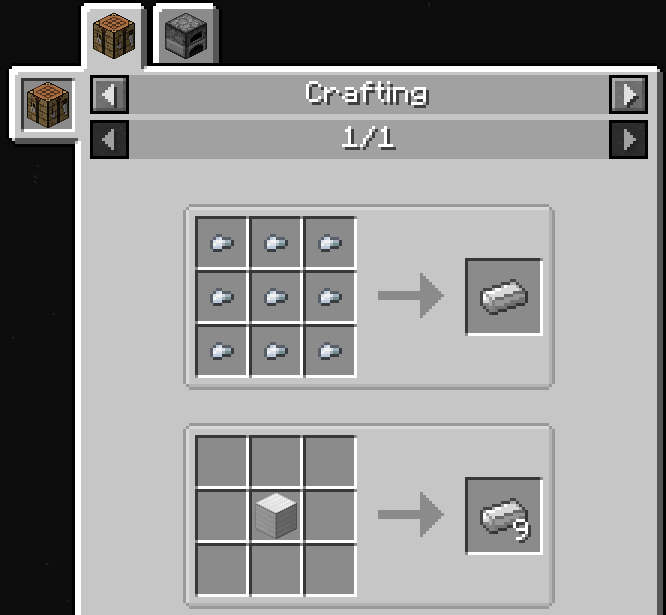
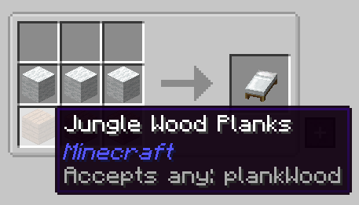

Author: WaitingIdly

# JEI Explained

JEI, for Just Enough Items, is the most downloaded mod of all time.
Its purpose is to search items and recipes in-game.
As such, it's crucial to understand how JEI works.

## How to search

JEI uses substring matching, meaning searching "coal" finds both "Coal" and "Charcoal".

Certain symbols do various specific actions:

"@" makes the following word search by mod - eg. "@botania" finds everything from the mod Botania.

"|" makes JEI do two searches for each side of the divider and combine the results.

"^" makes the following word search by color - eg. "^blue" will find all "blue" items in JEI.

You can exclude results by attaching a "-" before it, eg. "-@minecraft" finds everything that isn't from Vanilla Minecraft.

You can also combine these, for example, while "@alchem" would show both Alchemistry and Blood Magic: Alchemical Wizardry items, you can use "@alchem -@blood" to show only Alchemistry.

Double Clicking on the search bar toggles highlighting, which will darken any items that do not match your search in the Chest or Inventory you are looking in.

## How to navigate recipes

Pressing your "view recipes" key (default: R) or Left Clicking on an item in JEI displays all the recipes to craft that item - it won't show anything if there are no recipes to make it.

Pressing your "view uses" key (default: U) or Right Clicking on an item in JEI displays all the recipes that use that item - again, if there are none it won't do anything.

JEI displays recipes in different tabs - eg Crafting Table recipes are one tab, while the Furnace is another.

On the left side of the recipe viewer, you can see most of the places that the recipe can be done in.

You can use the scroll wheel or arrow keys to change pages when viewing recipes.
You can also use the Backspace key to go back to the previously viewed recipe.

If you click on the title of the page, you can "Show All Recipes", which displays every tab with every recipe in the game!

Some recipes have a rotating selection of valid items - for instance, a bed can take any type of wood. The type(s) are noted at the bottom  of the item tooltip.

Left Clicking the "+" button on the bottom right of a crafting recipe is a quick way of adding recipes to a Crafting Table.
If you do not have the items, this button will be grayed out and hovering will highlight the missing items.
If you'd like to move as many items into the Crafting field from your inventory as possible, hold Shift while pressing the "+" button.

## Bookmarks

Pressing the Bookmark key (default: A) saves the target item to the left side of your inventory. Pressing the Bookmark key over an item in the Bookmark sidebar will remove it from the list.

## Ghost Items

Some mods, notable AE2 (Applied Energistics 2) and EnderIO add the ability to drag ghost items from JEI into various inventories, such as filters and the Pattern Terminal.
